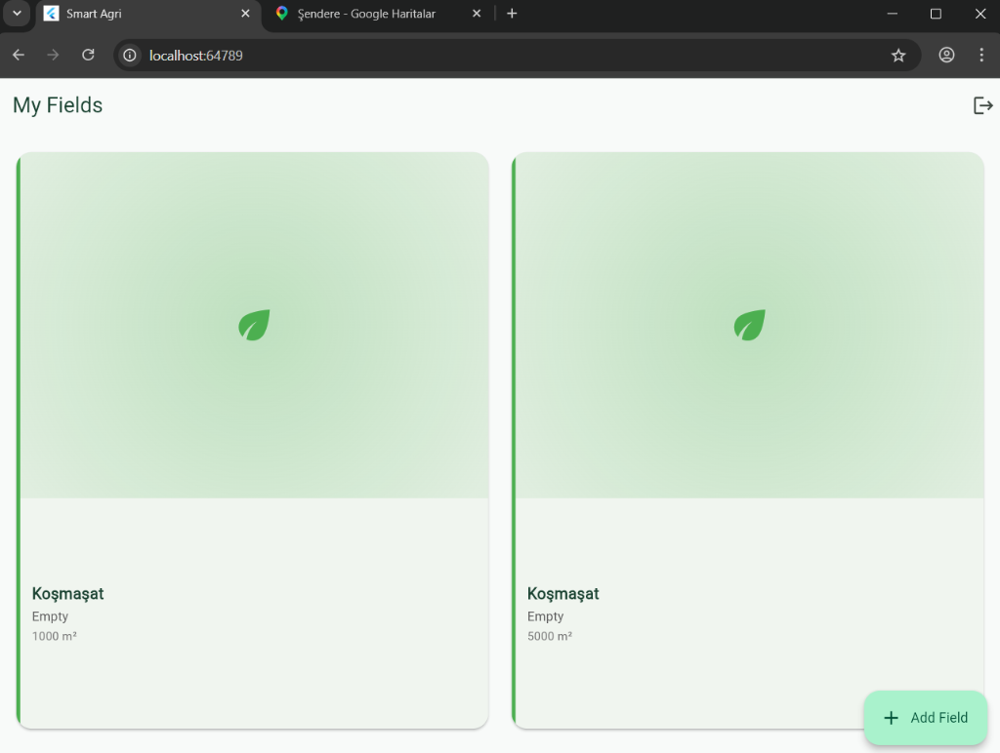

🌾 Smart Agri — Flutter Mobile & Web App

A cross-platform smart farming assistant built with Flutter + Riverpod.
Helps farmers track their fields, log irrigation, and get AI-powered
watering recommendations based on real-time weather forecasts.

## Features
- 🗺️ Interactive map-based field location picker
- 🌦️ Live weather & precipitation data via Open-Meteo API
- 💧 Intelligent irrigation scheduling by crop type
  (wheat, tomato, corn, potato, sunflower, pepper, cucumber)
- 🎮 Pixel-art animated farm scene reacting to field status
- 📊 Field dashboard with recommendation status (Optimal / Irrigate / Wait)
- 🔐 JWT-based authentication

## Tech Stack
Flutter · Dart · Riverpod · GoRouter · Dio · Open-Meteo API

## Status
🚧 MVP — Active development
